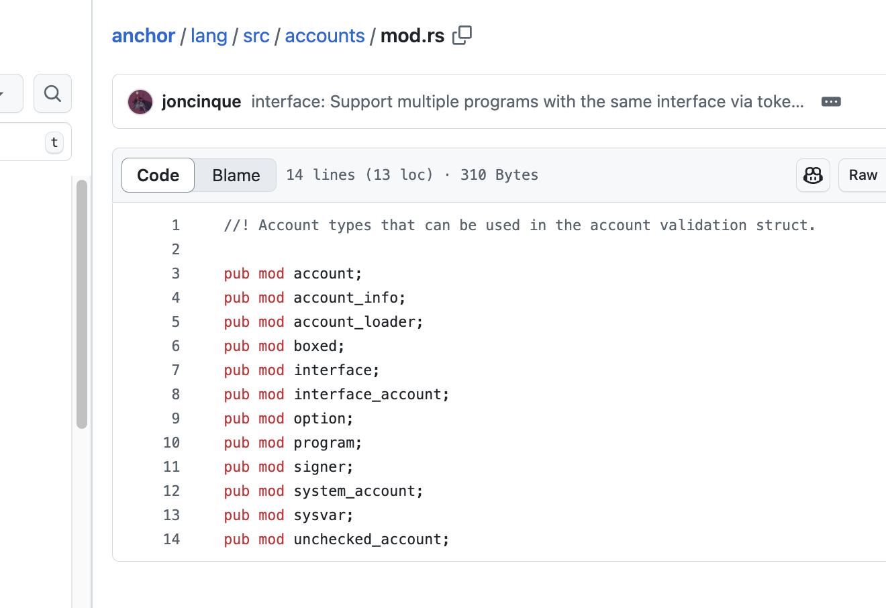
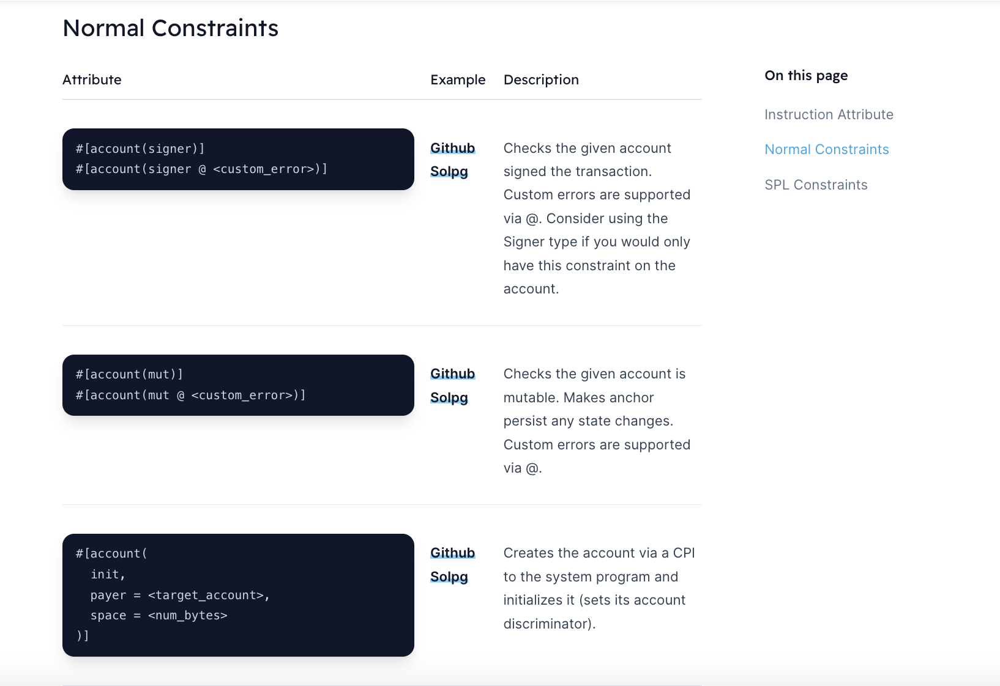
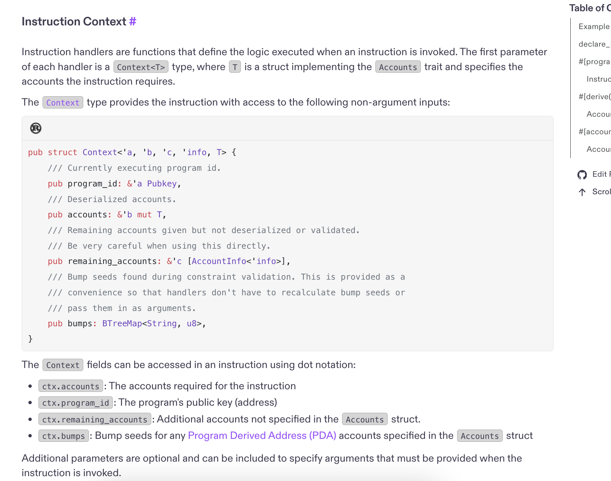

### 1 create a project

anchor init \<projectName>

### 2 use anchor_lang

`use anchor_lang::prelude::\*;`

### 3 declare_id! macro

`declare_id!("")`

path is here  
`/target/deploy/your_program_name.json`

sync
`anchor keys sync`

### 4 #[account] macro

create newAccount  
it has u64 data

### 5 #[derive(Accounts)] macro

Initialize struct

- new_account
- signer
- system_program

### 6 set account types

https://github.com/coral-xyz/anchor/blob/v0.30.1/lang/src/accounts/mod.rs

### 7 set account validation

https://www.anchor-lang.com/docs/account-constraints

### 8 #[program] macro

mod \<functionName> {}  
`use super::\*;`

### 9 create a pub function

Return : Result  
use ctx and args

### 10 instruction context

ctx.accounts  
use msg!, {}!

https://solana.com/docs/programs/anchor/program-structure#instruction-context

### 11 build

anchor build

### 12 deploy

#### 1 run a validator

`solana-test-validator`

#### 2 deploy

`anchor deploy`
